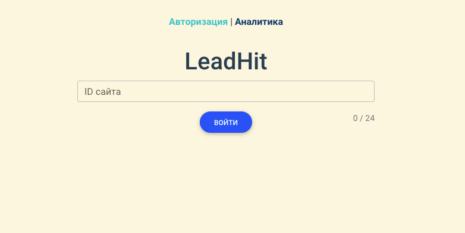

# LeadHit Frontend Test

This is my solution to the Frontend Developer Test for LeadHit.

### Table of Contents

- [Overview](#overview)
  - [The challenge](#the-challenge)
  - [Screenshot](#screenshot)
  - [Links](#links)
- [Development](#development)
  - [Built with](#built-with)
- [Author](#author)

## Overview

### The Challenge

Users should be able to:

- Input site ID
- Send request to server with site ID
- Check if site ID is 24 characters long
- Display error if site ID is not 24 characters long
- Get redirected to analytics page if request was sucessfull
- Save site ID in local storage
- Display table with visits data
- Get redirected to homepage if local storage has no site id data

### Screenshot

### Links

[Live Website](https://davidbraginsky.github.io/leadhit/)

## Development

### Built with

- Vue 
- Vue Router
- Vuex
- Amcharts
- ESLint

To deploy app locally download files manually or clone the repository. Install all dependencies using `npm install`. Once all dependencies have been installed deploy app using `npm run serve`.

## Author

[@davidbraginsky](https://github.com/davidbraginsky)
